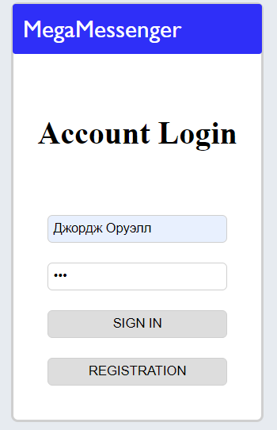
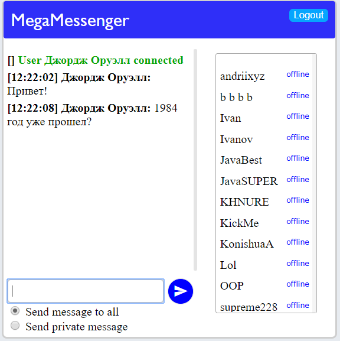
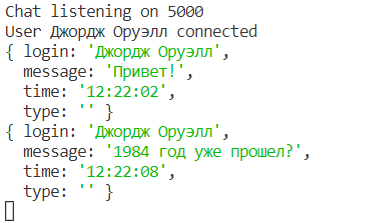

## Node.js Messanger

This project was made using:

- Node.js
- React.js
- Socket.io

### Instruction to run server

First one you need to copy this repository. 
Next step it is install all packages using package master NPM. 

- "express"
- "mysql"
- "socket.io"

Use it to instal some of the packages:

`npm install name-of-package`

After that you need to intall package into client 

`cd client`

`npm intall socket.io`

Also you should create file `mysql.json` and create JSON object:

{
"host": "NAME OF YOUR HOST",
"user": "USER",
"password": "PASSWORD",
"database": "NAME OF DATABASE",
"port": "DATABASE PORT"
}

Now all ready to start server. 
To start server you should be in main folder. 

Type next command into terminal `npm start` 
You should get next message - Chat listening on PORT  
Now server is ready to use 

### Instruction to client use

Open [http://localhost:3000](http://localhost:3000) to view it in the browser.

### Screenshots

